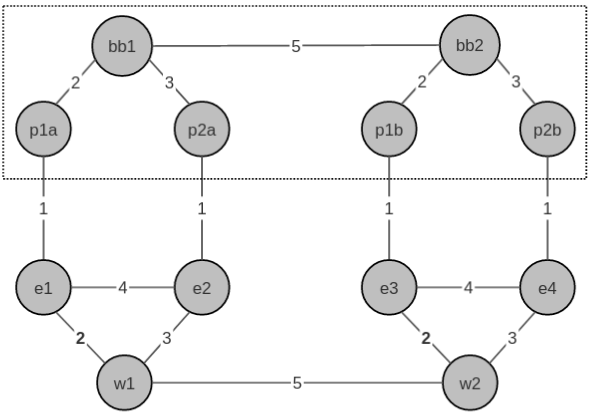

### Free Range Routing
Containerlab FRR builds use this WAN  topology.  

#### IS-IS Segment Routing lab  - _sr-frr.yml_
IS-IS with SR MPLS and TI-LFA build `/sr-frr/sr-frr.yml`  
Model allows label switching, implicit/explicit null testing, and node/link failure testing.  FRR IS-IS does not currently support SR-TE path's.    

#### BGP with diverse ISP


 | node a | node b | subnet          |   |node  | loopback0        |
 |--------|--------|-----------------|---|------|------------------|
 | bb1    | bb2    |  99.0.0.0/30    |   | bb1  | 99.100.0.1/32    |
 | bb1    | p1a    |  11.1.1.4/30    |   | bb2  | 99.200.0.1/32    |
 | bb1    | p2a    |  12.1.1.4/30    |   | p1a  | 11.100.1.1/32    |
 | bb2    | p1b    |  111.1.1.4/30   |   | p2a  | 12.100.1.1/32    |
 | bb2    | p2b    |  112.1.1.4/30   |   | p1b  | 111.100.1.1/32   |
 | p1a    | e1     |  11.1.1.0/30    |   | p2b  | 112.100.1.1/32   |
 | p2a    | e2     |  12.1.1.0/30    |   | e1   | 10.100.1.1/32    |
 | w1     | e1     |  10.10.10.0/30  |   | e2   | 10.100.1.2/32    |
 | w1     | e2     |  10.10.10.4/30  |   | w1   | 10.100.1.3/32    |
 | e1     | e2     |  10.10.10.8/30  |   | e3   | 10.200.1.1/32    |
 | p1b    | e3     |  111.1.1.0/30   |   | e4   | 10.200.1.2/32    |
 | p2b    | e3     |  112.1.1.0/30   |   | w2   | 10.200.1.3/32    |
 | w2     | e3     |  10.20.10.0/30  |
 | w2     | e4     |  10.20.10.4/30  |
 | e3     | e4     |  10.20.10.8.30  |
 | w1     | w2     |  10.0.0.0/30    |

frr ebgp default behavior is to require a policy-map for route advertisements.  
disable this with `no bgp ebgp-requires-policy`  


verify mpls modules location
----------------------------

start modules and verify
------------------------
```
$ sudo modprobe mpls_router
$ lsmod | grep mpls
mpls_router            40960  0

verify sysctl
-------------
sysctl -a | grep mpls
